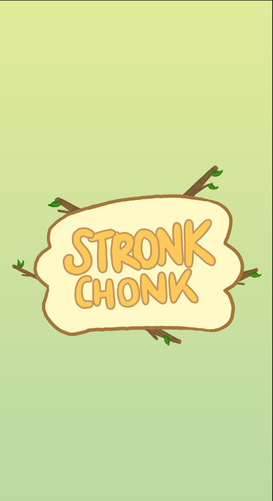
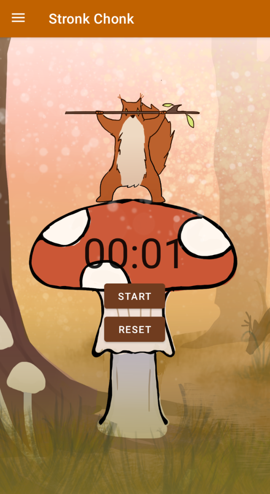
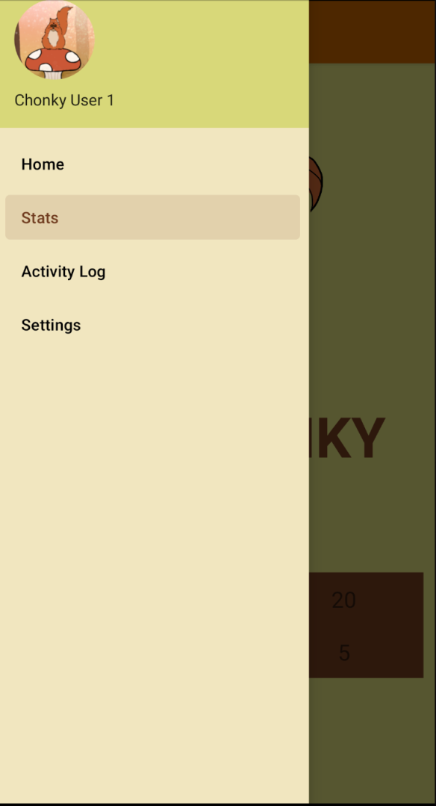
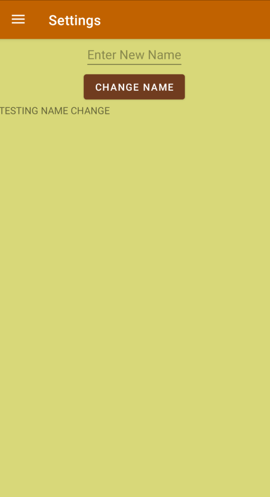
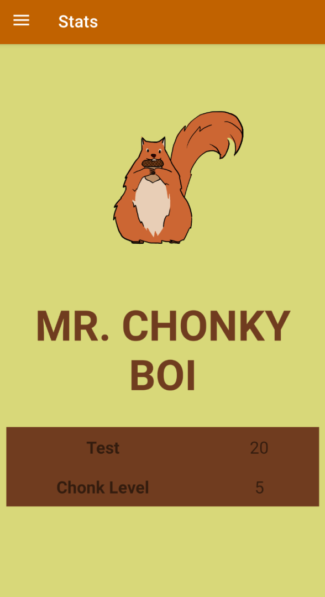

# Stronk Chonk

## Team: We Write Code Not Tragedies  

 
Yan Aigiarn Cheuk  
Niels Mainville  
Ojetta Ye  
Angela Zhu  
  

## The Application: The Only Workout Game You'll Ever Need
### 
In this game, the user has a mission of the utmost importance... taking care of Mr.Chonky, the neighborhood squirrel! Spending time workout out in real life is converted, in the game, as time spent gathering acorns. Therefore, the more time spent working out, the more acorns are gathered, and the chonkier the squirrel will become, providing it excellent protection for the harsh Canadian winter ahead.   
So work out like your life depends on it! Because it does, for the squirrel.   

 
  Welcome to Stronk Chonk.  

  
  
The user is then brought to the home page where the timer awaits. Once the user is ready to work out, they can press the start button, and the mushroom-chronometer will 
keep time. If anything interrupts their work out, they are free to pause the timer. Once the work out session is finished, the user can press the reset button to reset the time to zero, and the recorded time will be saved as a separated entry in the activity log. The squirrel will work out alongside with them, in encouragement.  
 

   
 
At the top of the screen, by tapping on the three lines on the top left of the screen, the hamburger, the navigation drawer will open. It allows the user 
to navigate to the other pages in this app. There is an activity log available, a settings page as well as a stats page.   
 
  
 

The user can view their past work outs, as well as add in notes on the type of workout, or exertion levels for example, in the Activity Log Page, pictured below.    
     

In the settings, the user can change their username.    
     

In Stats, the user can view the statistics of their squirrel, such as their level and how much XP they need to reach the next level.    
    

